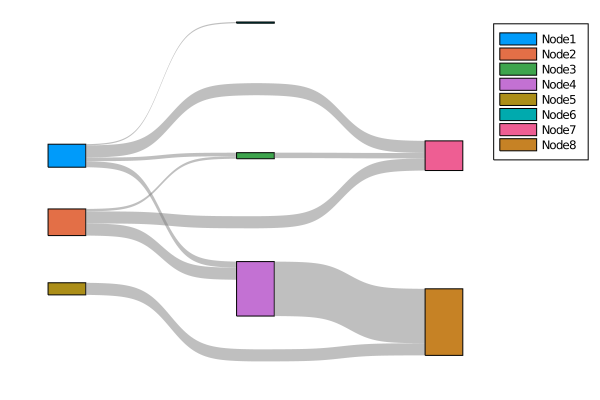
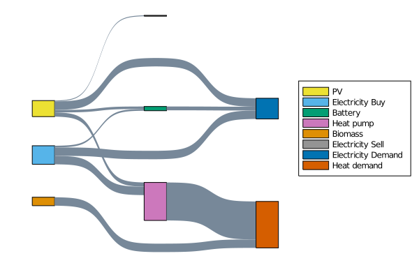
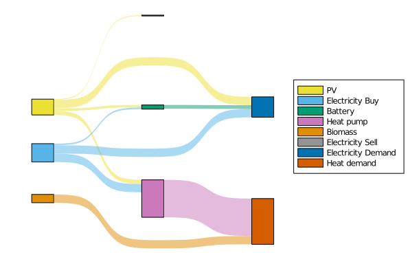
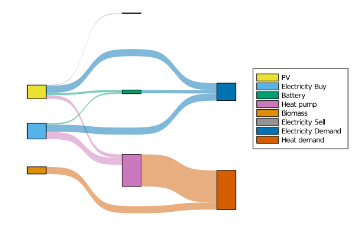
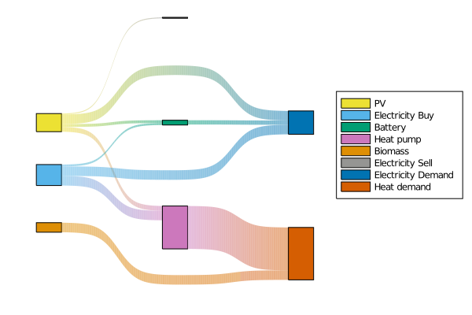

# SankeyPlots

This package provides a [Plots.jl] recipe for Sankey diagrams.

## Usage

```julia
using Plots
using SankeyPlots

src = [1, 1, 1, 1, 2, 2, 2, 3, 4, 5]
dst = [6, 3, 7, 4, 3, 7, 4, 7, 8, 8]
weights = [0.1, 0.3, 0.5, 0.5, 0.2, 2.8, 1, 0.45, 4.5, 3.3]

sankey(src, dst, weights)
```


Currently keyword arguments for the node names, the node colors and the stream colors are supported.

```julia
names = [
    "PV",
    "Electricity Buy",
    "Battery",
    "Heat pump",
    "Biomass",
    "Electricity Sell",
    "Electricity Demand",
    "Heat demand",
]
energy_colors = palette(:seaborn_colorblind)[[9, 10, 3, 5, 2, 8, 1, 4]]

sankey(
    src, dst, weights;
    node_labels=names,
    node_colors=energy_colors,
    edge_color="#789",
    legend=:outerright,
    fillalpha=1,
)
```


In addition to colors, `edge_color` also accepts the Symbols `:src`, `:dst` and `:gradient` to pick the colors of connected nodes.

```julia
sankey(
    src, dst, weights;
    node_labels=names,
    node_colors=energy_colors,
    edge_color=:src,
    legend=:outerright,
    fillalpha=1,
)
```


```julia
...
    edge_color=:dst,
...
```


```julia
...
    edge_color=:gradient,
...
```


## Acknowledgement

@oxinabox made this possible by implementing the algorithm that solves the layout in [LayeredLayouts.jl](https://github.com/oxinabox/LayeredLayouts.jl/).
