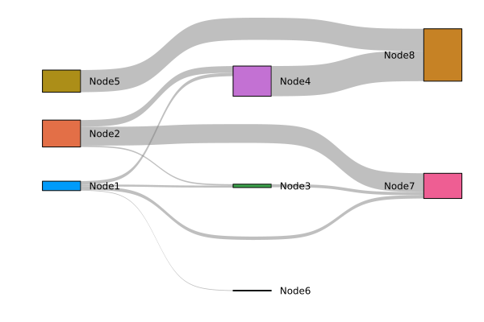

# SankeyPlots [](https://github.com/daschw/SankeyPlots.jl.jl/actions)

This package provides a [Plots.jl](https://github.com/JuliaPlots/Plots.jl) recipe for Sankey diagrams.

## Installation

```julia
julia> ]

pkg> add SankeyPlots
```

## Usage

The following examples describes how to create a Sankey diagram with the default settings.
The Sankey diagram is described by passing to the `sankey` function the source nodes `src`, destination nodes `dst`, and the weights `weights` of the edges. The nodes are indexed by integers starting from 1, and the size of the blocks and flows are proportional to the weights.

```julia
using SankeyPlots

src = [1, 1, 1, 1, 2, 2, 2, 3, 4, 5]
dst = [6, 3, 7, 4, 3, 7, 4, 7, 8, 8]
weights = [0.1, 0.3, 0.5, 0.5, 0.2, 2.8, 1, 0.45, 4.5, 3.3]

sankey(src, dst, weights)
```


In addition to [Plots.jl attributes](http://docs.juliaplots.org/latest/attributes/) the following keyword arguments are supported.

| Keyword argument | Default value | Options |
|---|---|----|
| `node_labels` | `nothing` | `AbstractVector{<:String}` |
| `node_colors` | `nothing` | Vector of [color specifications supported by Plots.jl](http://docs.juliaplots.org/latest/colors/) or [color palette](http://docs.juliaplots.org/latest/generated/colorschemes/#ColorPalette) |
| `edge_color` | `:gray` | Plots.jl supported [color](http://docs.juliaplots.org/latest/colors/), color selection from connected nodes with `:src`, `:dst`, `:gradient`, or an `AbstractDict{Tuple{Int, Int}, Any}` where `edge_color[(src, dst)]` maps to a color |
| `label_position` | `:inside` | `:legend`, `:node`, `:left`, `:right`, `:top` or `:bottom` |
| `label_size` | `8` | `Int` |
| `compact` | `false` | `Bool` |
| `force_layer` | `Vector{Pair{Int,Int}}()` | Vectors of Int pairs specifying the layer for every node e.g. `[4=>2]` to force node 4 in layer 3 |
| `force_order` | `Vector{Pair{Int,Int}}()` | Vectors of Int pairs specifying the node ordering in each layer e.g. `[1=>2]` to specify node 1 preceeds node 2 in the same layer |


```julia
names = [
    "PV",
    "Electricity Buy",
    "Battery",
    "Heat pump",
    "Biomass",
    "Electricity Sell",
    "Electricity Demand",
    "Heat demand",
]
energy_colors = palette(:seaborn_colorblind)[[9, 10, 3, 5, 2, 8, 1, 4]]

sankey(
    src, dst, weights;
    node_labels=names,
    node_colors=energy_colors,
    edge_color=:gradient,
    label_position=:bottom,
    label_size=7,
    compact=true,
    force_layer=[6=>2],
    force_order=[5=>1]
)
```


## Acknowledgement

@oxinabox made this possible by implementing the algorithm that solves the layout in [LayeredLayouts.jl](https://github.com/oxinabox/LayeredLayouts.jl/).
